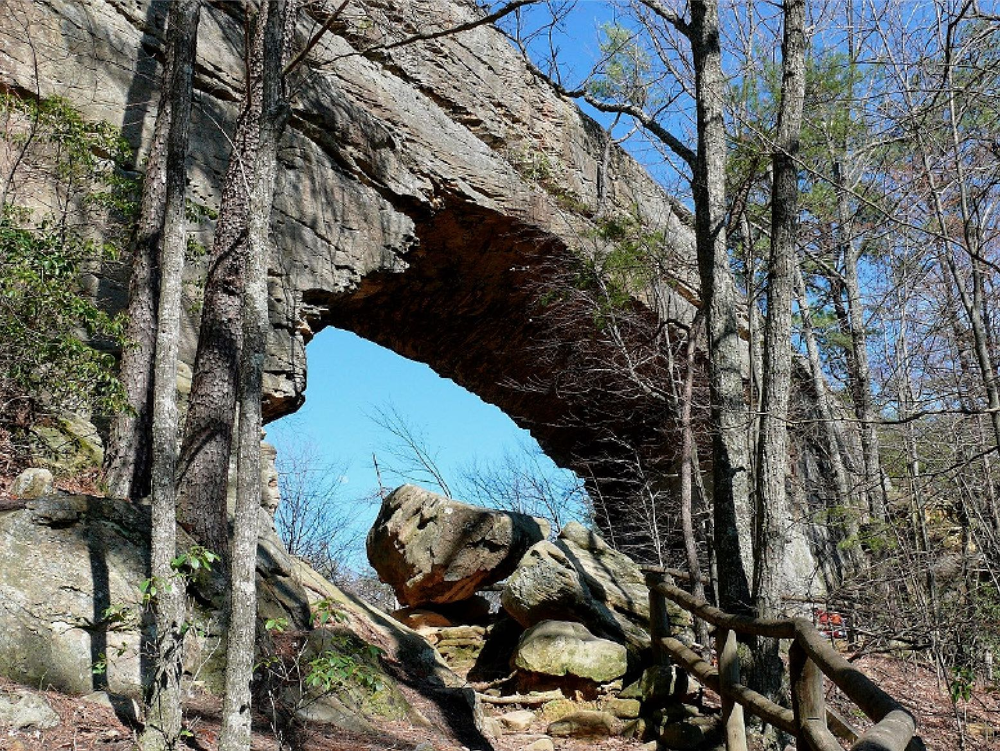
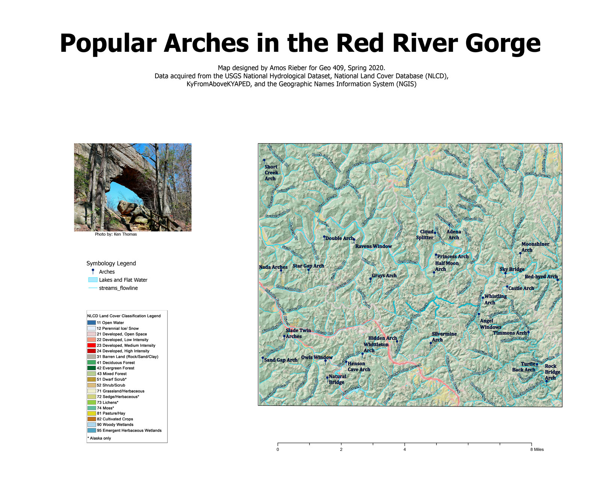
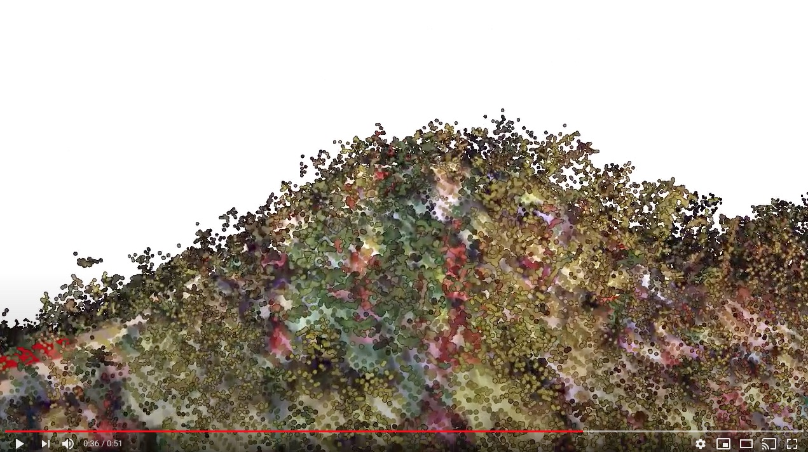

# Kentucky Maps

Kentucky is home to many great natural attractions such as waterways, Arches, and Overlooks.  This page will focused on the attractions in Eastern Kentucky and the Red River Gorge National Geological Area.

## The Kentucky Waterways

 
*The Kentucky River at High Bridge*

Kentucky has over 1,900 miles of navigable waterways which is the most of any state in the continental United States. Kentucky's abundance of navigable water has made an understanding of its directions importatnt to the inhabitatnce of ther area a vital part of life for hundreds of years.   

## Natural Arches
     
 *Natural Bridge, photograph by Ken Thomas*

Kentucky does not only have the most navigable waterways, it is also home to the most natural arches east of the mississppi.  Some of it's great natural arches include Mantal Rock and Natual Bridge.  For a map of the most popular arches in the Red River Gorge  National Geological Area 
[Download a GeoPDF of arches](basemap/rrg.pdf).

      
*Preview of map*

## Overlooks 

 
*12 O'clock Overlook, photograph by Victor Jordan*

As with any state that has moutains, Kentucky also has many great overlooks. Kingdom Come State Park in Cumberland, Ky. has many great overlook views including "12 O'clock Overlook". 
## Animation Tour of the Path to 12 O'Clock Overlook at Kingdom Come State Park

[Animation To 12 O'Clock Overlook](https://youtu.be/W0gAwp6gSCE)

 ## Visit web page

 [amosrieber.github.io/rrg/](https://amosrieber.github.io/rrg/)

## Sources and tools
All maps and animations were produced by Amos Rieber during the spring of 2020 for the University of Kentuck's GEO 409 course.  

Elevation data was acquired from the Kentucky's Elevation Data & Aerial Photography Program (KyFromAbove.ky.gov). Color aerial imagery was acquired from the National Agriculture Imagery Program (NAIP) stored on public FTP server maintained by Kentucky Division of Geographic Information (DGI)

Various ArcGIS Pro lidar and digital surface model tools were used to process and analyze these data. A Python script was developed to automate this process and is found in this Jupyter Notebook.